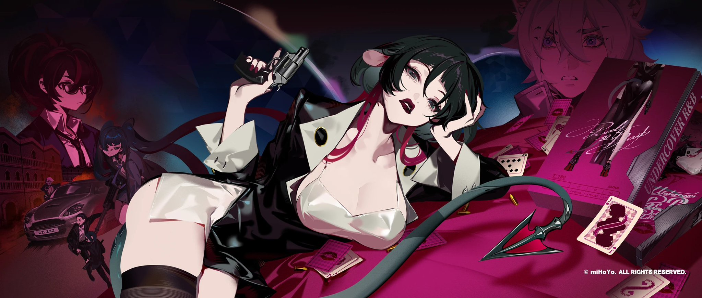

  🌸 **Welcome to my world of creativity!** 🌸

  
  &#8287;&#8287;&#8287;&#8287;&#8287;
  
  &#8287;&#8287;&#8287;&#8287;&#8287;
  
  &#8287;&#8287;&#8287;&#8287;&#8287;
  

✨ **Join me on my journey of cosplay, coding, and creativity!** ✨

<h1 align="center">🌸 Cosplayer | Anime Enthusiast | Developer 💻</h1>

  🗣 **EN | 日本語 |**

---
### 🌸 About Me
- 🐧 **Linux Enthusiast**: Exploring the open-source world and enjoying the power of Linux.
- 👘 **Cosplayer**: Sharing my passion for cosplay and creativity.
- 💻 **Developer**: Building projects with code and imagination.
- ✨ **Anime Enthusiast**: Inspired by anime culture and storytelling.
- 🌷 **Dreamer**: Believing in the magic of creativity and connection.

---

### 📊 GitHub Stats
<!-- 

  

 -->

---

  

