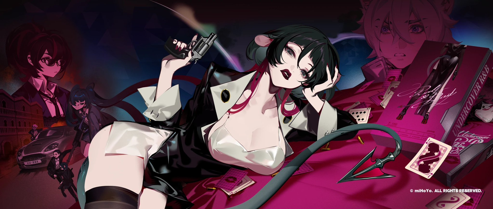

<div align="center">

<a href="https://kyuna-web.vercel.app/">
  
</a>

<pre>
╔══════════════════════════════════════════════════════════════════╗
║  ✧･ﾟ: *✧･ﾟ:*  QUEEN OF NIGHT MODE  *:･ﾟ✧*:･ﾟ✧                   ║
╚══════════════════════════════════════════════════════════════════╝

      ∧＿∧
     (｡･ω･)ﾉﾞ
    / 🎀  🎀 \
    |  fox girl  |
     \_________/

   「 code · cosplay · chaos 」

   ...Did you summon me?
   Onee-san has arrived. ✦

   ⚔️  cosplayer  ·  OSS dev  ·  AI comics  ·  YouTube  ⚔️
   🦊  kitsune  ·  fox girl  · 中日蒙  ·  weeb coder  🦊

╰─────────────────────────────────────────────────────────────╯
</pre>

[](https://www.youtube.com/@amarihana)
[](https://x.com/kyuna0312)
[](https://discord.gg/shiba)
[](https://www.instagram.com/kyuna0312/)
[](https://kyuna-web.vercel.app/)

<br/>

```
  ┌───·  TECH STACK  ·──┐
  │  🦊 TypeScript      │
  │  ⚡ JavaScript      │
  │  🦀 Rust            │
  │  🔵 Go              │
  │  🐍 Python          │
  │  🌙 Lua             │
  │  💚 Linux           │
  └─────────────────────┘
```

<br/>

<a href="https://github.com/kyuna0312">
  
</a>

</div>

---

## ✧ Profile Card

```
   ╭─────────────────────────────────────────────╮
   │  ☽  MAGICAL  PROFILE  カード  ♡              │
   ╰─────────────────────────────────────────────╯
```

Ah, you've found my profile. How delightful.

**Cosplayer + OSS dev** — costumes and commits, all in a day's work. I craft UIs, APIs, low-level toys... and occasionally, entire **AI comic pipelines** for YouTube.

One does not simply build fox girl looks AND magical tooling, you see. It requires a certain... *intensity*.

```
  🎭 Languages:  EN  ·  日本語  ·  Монгол
  🔗 Socials:    X/IG/Discord @kyuna0312
  🌐 Web:        kyuna-web.vercel.app
  💻 GitHub:     @kyuna0312
```

---

## ✧ Featured Projects

<p align="center">
  <a href="https://github.com/kyuna0312/dotfiles"></a>
  <a href="https://github.com/kyuna0312/kyuna_web"></a>
  <a href="https://github.com/kyuna0312/InariWrite"></a>
</p>

```
  ┌─────────────────────────────────────────────────────────┐
  │  ✦  PROJECT  LIST  ✦                                   │
  ├─────────────────────────────────────────────────────────┤
  │  🦊 dotfiles (17★)    │  Productive dev config         │
  │                       │  zsh · nvim · tmux · Claude   │
  │  🎀 NyanVim (6★)      │  Custom Neovim config          │
  │                       │  cute aesthetics · Lua        │
  │  🐾 nyanix_scratch    │  Toy operating system           │
  │     _linux (5★)       │  C                             │
  │  📝 Word2Vector       │  Mongolian word embeddings    │
  │     Mongolia (6★)     │  CSS                           │
  │  🌸 kyuna_web         │  Portfolio site                │
  │                       │  Next.js · Chakra UI · i18n   │
  │  ✏️ InariWrite        │  Markdown editor               │
  │                       │  Mongolian-first · TS/Rust    │
  └─────────────────────────────────────────────────────────┘
```

---

## ✧ Stats

<p align="center">
  
</p>

<p align="center">
  
  
</p>

<p align="center">
  
</p>

<p align="center">
  <a href="https://github.com/ryo-ma/github-profile-trophy">
    
  </a>
</p>

---

## ✧ Connect

<p align="center">
  <a href="https://github.com/kyuna0312/kyuna0312">
    
  </a>
</p>

> "I've taken an interest in you. Do try to be useful." — The Queen of Night ♠

<pre align="right"><code>kyuna0312@github:~$ █</code></pre>

---

<p align="center">
  <sub>Made with 🩷 and ☕ · Kyuna 0312 · 2024</sub>
</p>